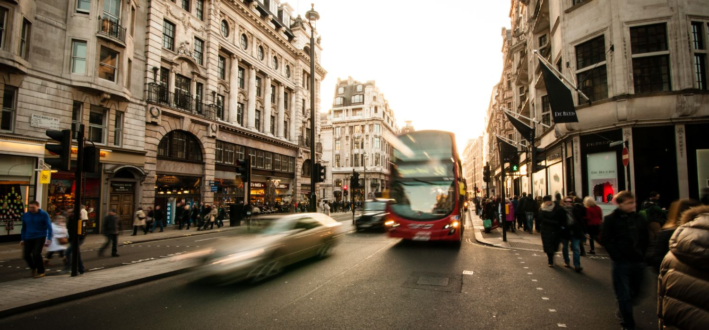

# Projet travel word
  

[voir la maquette](https://giusmili.github.io/travel_word_project/)
&copy; Powered by GiusMili - 2021 

## Repertoire racine

```
├── 📁 .dist
├── 📁 asset
│   ├── 🖼️ cinqueterre.jpg
│   ├── 🖼️ facebook.svg
│   ├── 🖼️ instagram.svg
│   ├── 🖼️ linkedin.svg
│   ├── 🖼️ london2.jpg
│   ├── 🖼️ mountains2.jpg
│   ├── 🖼️ newyork2.jpg
│   ├── 🖼️ ocean2.jpg
│   ├── 🖼️ paris.jpg
│   ├── 🖼️ pisa.jpg
│   ├── 🖼️ sanfran.jpg
│   └── 🖼️ twitter.svg
├── 📁 css
│   └── 🎨 style.css
├── 📁 favicon
│   ├── 🖼️ android-chrome-192x192.png
│   ├── 🖼️ android-chrome-512x512.png
│   ├── 🖼️ apple-touch-icon.png
│   ├── 🖼️ favicon-16x16.png
│   ├── 🖼️ favicon-32x32.png
│   ├── 📄 favicon.ico
│   └── 📄 site.webmanifest
├── 📁 js
│   └── 📄 app.js
├── ⚙️ .gitignore
├── 🌐 index.html
├── ⚙️ package-lock.json
├── ⚙️ package.json
└── 📝 readme.md
```
